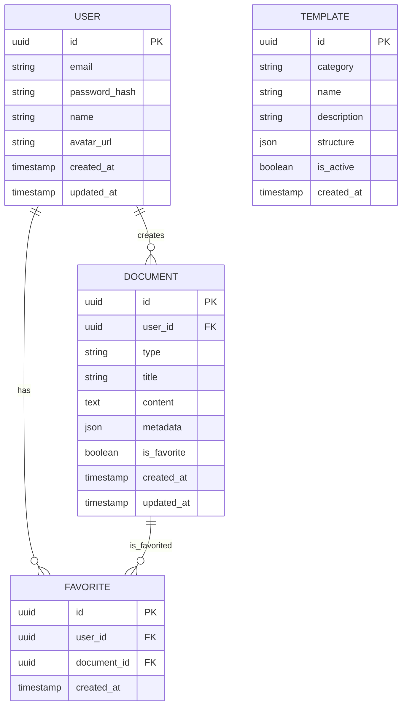

# OfficialAI Database Documentation

## 1. Overview
PostgreSQL database with Prisma ORM, using UUIDs as primary keys for scalability.

## 2. ER Diagram (Mermaid)

## 3. Tables

### 3.1 users
| Column           | Type      | Constraints               |
|-------------------|-----------|---------------------------|
| id                | UUID      | Primary Key               |
| email             | VARCHAR   | Unique, Not Null          |
| password_hash     | VARCHAR   | Not Null                  |
| name              | VARCHAR   | Not Null                  |
| avatar_url        | VARCHAR   | Nullable                  |
| created_at        | TIMESTAMP | Default: NOW()            |
| updated_at        | TIMESTAMP | Default: NOW()            |

### 3.2 documents
| Column           | Type      | Constraints               |
|-------------------|-----------|---------------------------|
| id                | UUID      | Primary Key               |
| user_id           | UUID      | Foreign Key to users.id   |
| type              | VARCHAR   | Not Null                  |
| title             | VARCHAR   | Not Null                  |
| content           | TEXT      | Not Null                  |
| metadata          | JSONB     | Nullable                  |
| is_favorite       | BOOLEAN   | Default: FALSE            |
| created_at        | TIMESTAMP | Default: NOW()            |
| updated_at        | TIMESTAMP | Default: NOW()            |

### 3.3 favorites
| Column           | Type      | Constraints               |
|-------------------|-----------|---------------------------|
| id                | UUID      | Primary Key               |
| user_id           | UUID      | Foreign Key to users.id   |
| document_id       | UUID      | Foreign Key to documents.id |
| created_at        | TIMESTAMP | Default: NOW()            |

### 3.4 templates
| Column           | Type      | Constraints               |
|-------------------|-----------|---------------------------|
| id                | UUID      | Primary Key               |
| category          | VARCHAR   | Not Null                  |
| name              | VARCHAR   | Not Null                  |
| description       | TEXT      | Nullable                  |
| structure         | JSONB     | Not Null                  |
| is_active         | BOOLEAN   | Default: TRUE             |
| created_at        | TIMESTAMP | Default: NOW()            |
